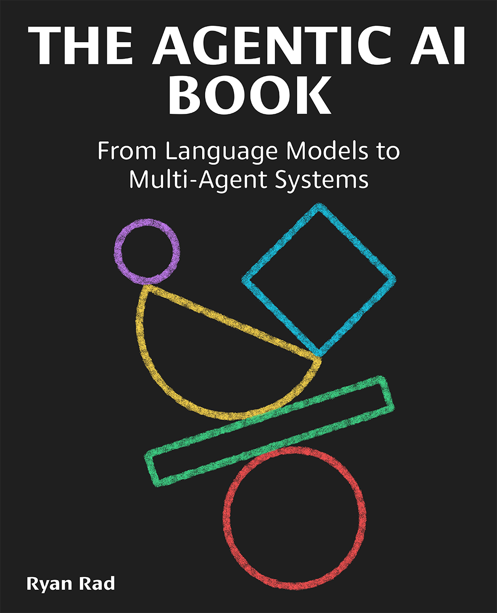

# The Agentic AI Book

<a href="https://www.linkedin.com/in/realryanrad/"></a>
<a href="https://aidoses.substack.com/"></a>

Welcome! In this repository you will find the companion Jupyter notebooks for the book [**The Agentic AI Book**](https://book.ryanrad.org) written by [Dr. Ryan Rad](https://www.linkedin.com/in/realryanrad/).

<p align="center"><b><i>From Language Models to Multi-Agent Systems — a practical guide to building production-ready agentic AI systems.</i></b></p>

<p align="center">
  <a href="https://book.ryanrad.org">
    
  </a>
</p>

<br>

The book is available on:

* 🖥️ [Leanpub](https://leanpub.com/theAgenticAIbook) — E-Book / EPUB
* 🖥️ [Gumroad](https://realryanrad.gumroad.com/l/TheAgenticAIBook) — E-Book / EPUB
* 🖥️ [Google Books](https://books.google.ca/books/about?id=IAXQEQAAQBAJ) — E-Book
* 📘 [Amazon](https://amazon.com/theAgenticAIbook) — Paperback

---

## Table of Contents

We recommend running all notebooks in **Google Colab** for the easiest setup — it provides a free GPU and requires no local installation. All notebooks were built and tested on Colab, making it the most stable platform, though any cloud provider will work.

| Chapter | Notebook |
|---|---|
| **Chapter 1: The AI Landscape** — *From Rule-Based Systems to Intelligent Learning* | [](https://colab.research.google.com/github/ryanmrad/The-Agentic-AI-Book/blob/main/chapter01/Chapter_01_The_AI_Landscape.ipynb) |
| **Chapter 2: Language Models and Multimodal Intelligence** — *The Foundation of Intelligent Agents* | [](https://colab.research.google.com/github/ryanmrad/The-Agentic-AI-Book/blob/main/chapter02/Chapter_02_Language_Models_and_Multimodal_Intelligence.ipynb) |
| **Chapter 3: Building with Large Language Models** — *Techniques for Control, Adaptation, and Reliability* | [](https://colab.research.google.com/github/ryanmrad/The-Agentic-AI-Book/blob/main/chapter03/Chapter_03_Building_with_LLMs.ipynb) |
| **Chapter 4: Agent Building Blocks** — *Core Components and Cognitive Architecture* | [](https://colab.research.google.com/github/ryanmrad/The-Agentic-AI-Book/blob/main/chapter04/Chapter_04_Agent_Building_Blocks.ipynb) |
| **Chapter 5: Multi-Agent Architectures and Design Patterns** — *From Single Agents to Multi-Agent Ecosystems* | [](https://colab.research.google.com/github/ryanmrad/The-Agentic-AI-Book/blob/main/chapter05/Chapter_05_Multi_Agent_Architectures.ipynb) |
| **Chapter 6: Production-Ready Agentic AI** — *D2D: From Design to Deployment* | [](https://colab.research.google.com/github/ryanmrad/The-Agentic-AI-Book/blob/main/chapter06/Chapter_06_Production_Ready_Agentic_AI.ipynb) |

> **Tip:** Check the [setup](./setup/) folder for a quick-start guide to install all packages locally. Results may vary slightly depending on your OS, Python version, and dependency versions, but should closely match the examples in the book.

---


## Bonus Content

Stay up to date with supplementary guides, visual explainers, and deep-dives on emerging agentic AI topics via the [AI Doses Newsletter](https://aidoses.substack.com/).

---

## Citation

If you find this book or companion notebooks useful in your research or work, please consider citing:

```bibtex
@book{agentic-ai-book,
  author    = {Ryan Rad},
  title     = {The Agentic AI Book},
  year      = {2026},
  url       = {https://book.ryanrad.org},
  github    = {https://github.com/ryanmrad/The-Agentic-AI-Book}
}
```
